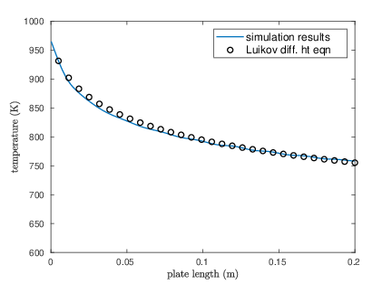
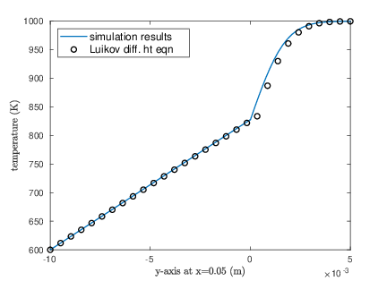
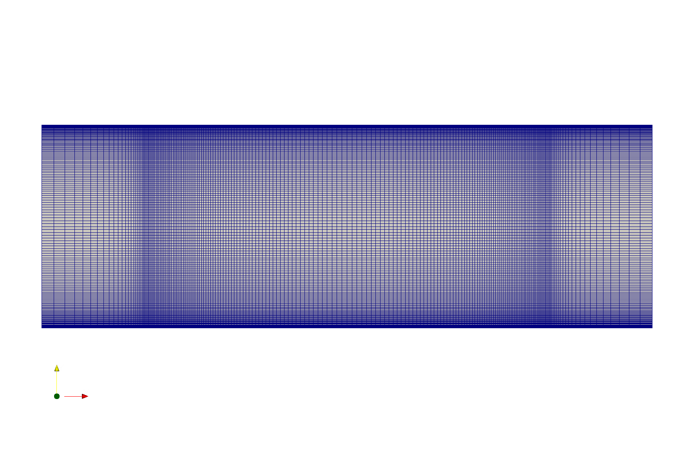

OpenFOAM+CalculiX Coupling For *Conjugate Heat Transfer*
=========================================================

.. image:: https://travis-ci.org/chiao45/foam_ccx_cht.svg?branch=master
    :target: https://travis-ci.org/chiao45/foam_ccx_cht

Purpose & Motivation
--------------------

This repository is for testing the in-house multiphysics coupling framework and
preparing the *conjugate heat transfer* paper. The project is led by
`Dr. Jim Jiao <http://www.ams.sunysb.edu/~jiao/>`_ and his *NumGeom* research
group at `Stony Brook University <https://www.stonybrook.edu/>`_.

Current Settings
----------------

The fluid solver is the well-known OpenFOAM_ that uses *finite volume methods*
(FVM). For solid, on the other hand, we choose CalculiX_, one of the best
open-sourced *finite element analysis* (FEA) software packages. Particularly,
we utilize the ``buoyantPimpleFoam`` and the ``NLGEOM`` solvers.

It's worth noting that in order to couple the two solvers, we have to modify
their source codes, so that we can build them into a single executable binary.
This helps us save time on developing a communication framework for handling
multiple executable binaries, e.g. using socket communication. We further wrap
the two solvers with Python_ programming language by using Cython_ and SWIG_.

On the interface, we current uses the *modified moving least square* (MMLS)
method, that comes with the DataTransferKit-2.0_ package.

Currently, we have verified our setup by analyzing our results against
Dr. A.V.Luikov's `differential heat transfer module`_ that applys for conjugate
problems. The problem model is borrowed from `Dr. Tom Vertsraete`_'s Ph.D.
thesis section 4.

**Fluid (air)**:

- .. image:: https://latex.codecogs.com/gif.latex?\rho&space;=&space;0.3525\&space;kg/m^3
- .. image:: https://latex.codecogs.com/gif.latex?c_p&space;=&space;1142.6\&space;J/kgK
- .. image:: https://latex.codecogs.com/gif.latex?\mu&space;=&space;3.95\cdot10^{-5}\&space;Ns/m^2
- .. image:: https://latex.codecogs.com/gif.latex?\kappa&space;=&space;0.06808\&space;W/mK
- .. image:: https://latex.codecogs.com/gif.latex?Pr&space;=&space;0.6629
- .. image:: https://latex.codecogs.com/gif.latex?\textbf{R}&space;=&space;287\&space;J/kgK

**Solid**:

For solid side, we simply choose the thermal conductivity coefficients to be
3 and 0.3, so that we have two test cases, i.e. Biot=0.1 and Biot=1 resp.

Here are the result plots for Biot=1

.. table::

    +-----------------------+--------------------+
    |                |fig1| + |fig2|             |
    +-----------------------+--------------------+
    | interface temperature + vertical at x=0.05 |
    +-----------------------+--------------------+

Here is the fluid mesh, the solid simply uses unstructured P1 elements

.. references

.. _OpenFOAM: https://openfoam.org
.. _CalculiX: http://www.calculix.de/
.. _DataTransferKit-2.0: https://github.com/ORNL-CEES/DataTransferKit/tree/dtk-2.0
.. _Python: https://www.python.org/
.. _Cython: http://cython.org/
.. _SWIG: http://www.swig.org/
.. _differential heat transfer module: https://www.sciencedirect.com/science/article/pii/0017931074900878
.. _Dr. Tom Vertsraete: https://www.vki.ac.be/index.php/departments/tu-department-other-menu-93/people-other-menu-94/264-faculty/414-tom-vertsraete
