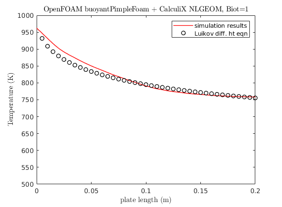

OpenFOAM+CalculiX Coupling For *Conjugate Heat Transfer*
=========================================================

.. image:: https://travis-ci.org/chiao45/foam_ccx_cht.svg?branch=master
    :target: https://travis-ci.org/chiao45/foam_ccx_cht

Purpose & Motivation
--------------------

This repository is for testing the in-house multiphysics coupling framework and
preparing the *conjugate heat transfer* paper. The project is led by
`Dr. Jim Jiao <http://www.ams.sunysb.edu/~jiao/>`_ and his *NumGeom* research
group at `Stony Brook University <https://www.stonybrook.edu/>`_.

Current Settings
----------------

The fluid solver is the well-known OpenFOAM_ that uses *finite volume methods*
(FVM). For solid, on the other hand, we choose CalculiX_, one of the best
open-sourced *finite element analysis* (FEA) software packages. Particularly,
we utilize the ``buoyantPimpleFoam`` and the ``NLGEOM`` solvers.

It's worth noting that in order to couple the two solvers, we have to modify
their source codes, so that we can build them into a single executable binary.
This helps us save time on developing a communication framework for handling
multiple executable binaries, e.g. using socket communication. We further wrap
the two solvers with Python_ programming language by using Cython_ and SWIG_.

On the interface, we current uses the *modified moving least square* (MMLS)
method, that comes with the DataTransferKit-2.0_ package.

Currently, we have verified our setup by analyzing our results against
Dr. A.V.Luikov's `differential heat transfer model`_ that applys for conjugate
problems. The problem model is borrowed from `Dr. Tom Vertsraete`_'s Ph.D.
thesis section 4.

**Fluid (air)**:

  - :math:`\rho = 0.3525 kg/m^3`
  - :math:`C_p = 1142.6 J/kgK`
  - :math:`\mu = 3.95\cdot10^{-5} Ns/m^2`
  - :math:`\kappa = 0.06808 W/mK`
  - :math:`Pr = 0.6629`
  - :math:`R = 287 J/kgK`

**Solid**:

For solid side, we simply choose the thermal conductivity coefficients to be
3 and 0.3, so that we have two test cases, i.e. :math:`Biot=0.1` and
:math:`Biot=1` resp.

Here is the result plot for :math:`Biot=1`

Here is the fluid mesh, the solid simply uses unstructured P1 elements

.. image:: mesh.png

References
----------

.. _OpenFOAM: https://openfoam.org
.. _CalculiX: http://www.calculix.de/
.. _DataTransferKit-2.0: https://github.com/ORNL-CEES/DataTransferKit/tree/dtk-2.0
.. _Python: https://www.python.org/
.. _Cython_: http://cython.org/
.. _SWIG: http://www.swig.org/
.. _differential heat transfer module: https://www.sciencedirect.com/science/article/pii/0017931074900878
.. _Dr. Tom Vertsraete: https://www.vki.ac.be/index.php/departments/tu-department-other-menu-93/people-other-menu-94/264-faculty/414-tom-vertsraete
